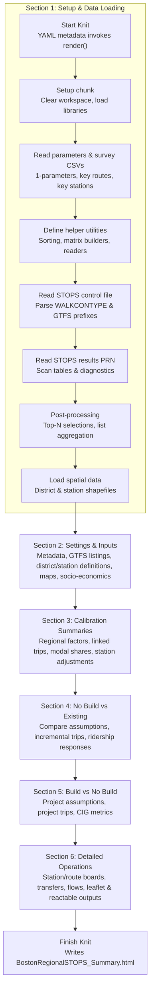
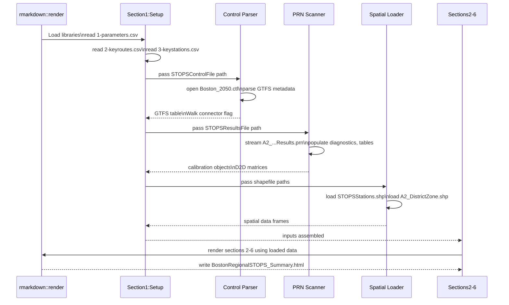

# Boston Regional STOPS Summary Report — Execution Flow

The `Boston_Regional_STOPS_Summary_Report.rmd` document is structured as a single knit that loads data, derives diagnostic tables, and then renders narrative sections in sequence. The flow below highlights the major execution stages and how each depends on earlier work.

### Stage Notes
- **Section 1 – Setup & Data Loading:** Chunks `## 0.0`–`0.9` reset the workspace, load libraries, read CSV parameters, define helper functions, parse the STOPS control file, stream the `.prn` results, and prepare sorted lists plus shapefiles.
- **Section 2 – Settings & Inputs:** Presents STOPS configuration, GTFS inventories, district/station definitions, maps, and socio-economic context built from previously loaded objects.
- **Section 3 – Calibration Summaries:** Uses calibration tables and survey comparisons to show linked trips, modal shares, transfer rates, and station adjustments.
- **Section 4 – No Build vs Existing:** Compares base and no-build assumptions, incremental trips, and ridership responses using stored diagnostics.
- **Section 5 – Build vs No Build:** Highlights project assumptions, incremental trips, VMT impacts, and CIG metrics derived from earlier tables.
- **Section 6 – Detailed Operations:** Delivers detailed station/route boards, transfers, and flow visualizations (leaflet/reactable) built on the processed datasets.
- **Completion:** The knit hook in the YAML writes `BostonRegionalSTOPS_Summary.html` after all sections finish.

### File Inputs
- `reports/Summary_HTML_Report/1-parameters.csv` — Scenario metadata, file paths, and calibration flags consumed during setup.
- `reports/Summary_HTML_Report/2-keyroutes.csv` — Route IDs highlighted in corridor-level summaries.
- `reports/Summary_HTML_Report/3-keystations.csv` — Station group definitions and project station highlights.
- `reports/Summary_HTML_Report/Boston_2050.ctl` *(via `STOPSControlFile` parameter)* — STOPS control file parsed to extract GTFS prefixes, dates, and walk connector settings.
- `reports/Summary_HTML_Report/A2_MBTA-CATA-MWRTA-BATA-MVRTA#MBTA50-CATA-MWRTA-BATA-MVRTA#MBTA50-CATA-MWRTA-BATA-MVRTA_STOPSY2050Results.prn` *(via `STOPSResultsFile` parameter)* — Main STOPS results dump scanned for calibration tables, ridership summaries, and D2D matrices.
- `reports/Summary_HTML_Report/STOPSStations.shp` *(plus .dbf/.shx/.prj sisters via `STOPSStationSHPFile`)* — Station geometry and attributes used in maps and station-based summaries.
- `reports/Summary_HTML_Report/A2_DistrictZone.shp` *(plus .dbf/.shx/.prj via `STOPSDistrictSHPFile`)* — District polygon layer for mapping and D2D matrix labeling.
- `reports/Summary_HTML_Report/custom.css` — Theme overrides applied by the readthedown template.
- `reports/Summary_HTML_Report/Boston_MPO_Logo.png` — Branding asset injected into the document header.

### File Outputs
- `reports/Summary_HTML_Report/BostonRegionalSTOPS_Summary.html` — Final rendered HTML report written by the knit hook.

### Input/Output Sequence

*Participants: `Knit` represents `rmarkdown::render`, `Setup` encapsulates the Section 1 preparation chunks, `Control` parses the STOPS control file, `Results` streams the `.prn` diagnostics, `Spatial` loads shapefiles, and `Report` covers Sections 2–6 that consume those objects.*

### Python Migration Feasibility & Risks
- **Component Footprint:** Each section leans heavily on R-specific constructs—`dplyr` pipelines, `knitr`/`kableExtra` formatting, `leaflet`/`reactable` widgets, and GDAL bindings via `rgdal`. Recreating these in Python would require equivalent stacks (e.g., pandas, geopandas, folium, plotly/dash tables) and reimplementation of ~3,500 lines of orchestration logic, including bespoke matrix parsers and summarizers.
- **Helper Functions:** The utility suite (matrix sorting, aggregation, fixed-width PRN readers, shapefile handling) would need end-to-end rewrites. Many rely on R idioms (e.g., `addmargins`, `read.fwf`, `kable_styling`) without direct Python analogues, raising effort and regression risk if behavior diverges.
- **Report Rendering:** The document’s R Markdown workflow bundles narrative, inline calculations, and HTML widgets in one knit. Porting to a Python framework (Jupyter, nbconvert, Sphinx, or static site generators) requires redesigning layout, templating, and widget embedding. Matching the existing readthedown theme and table styling would add extra front-end work.
- **Package Parity Risks:** Critical dependencies such as `rgdal` (soon superseded by `sf`/`terra`) and `RStudioConsoleRender` lack straightforward Python replacements. Loss of these could break shapefile ingestion or interactive console outputs unless custom pipelines or APIs are introduced.
- **Data Pipeline Stability:** Calibration lists, GTFS parsing, and D2D matrix logic are tightly coupled to R data frames. Any misalignment in type handling or floating-point formatting during a port could cascade into incorrect metrics in downstream sections (Sections 3–6).
- **Migration Recommendation:** A phased approach—first modularizing R helpers and adding automated tests—would reduce risk before attempting Python parity. Without such scaffolding, a direct migration risks extended downtime for the reporting workflow and inconsistent deliverables.
