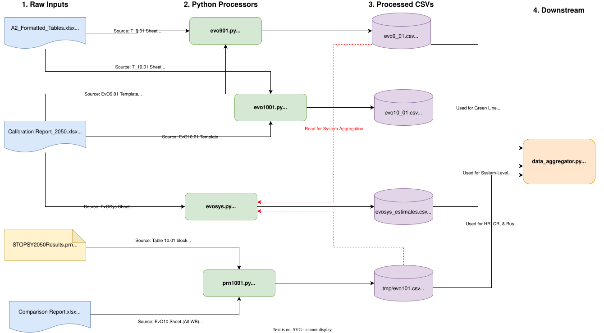

# Shop Pipeline Guide



If the preview drops labels, open `shop/docs/dataflowchart.svg` directly in a browser. The SVG is a draw.io export and still contains the embedded diagram source.

## What this folder is for

`shop/` is the STOPS output extraction area. It turns workbook- and PRN-based STOPS outputs into CSVs that are easier to inspect and reuse.

The logic comes from two Excel workbooks:

- `calibration/Boston_Regional_STOPS Calibration Report_2050.xlsx`
  This is the main calibration workbook whose lookup formulas and aggregation logic are being replicated.
- `shop/Boston_Regional_STOPS _mbta50_2045_2050_comparison_2024.xlsx`
  This is the comparison workbook used mainly by the PRN route parser to map route ids to names, agencies, and modes, including the `EvO10.01-2045` and `EvO10.01-2050` variants.

The merged code now has two layers:

1. `shop/run_batch_pipelines.py` and `shop/run_batch.ipynb`
   These are the practical entrypoints.
2. `shop/stops_data_parse/*.py`
   These are the low-level parser modules.

## Current layout

| Path | Role |
| --- | --- |
| `shop/run_batch.ipynb` | Notebook wrapper for running the pipeline interactively |
| `shop/run_batch_pipelines.py` | Batch/notebook orchestrator that runs the parsers in sequence |
| `shop/stops_data_parse/base.py` | Shared XLSX XML reader |
| `shop/stops_data_parse/evo901.py` | Stop-level `EvO9.01` CSV builder |
| `shop/stops_data_parse/evo1001.py` | Route-level `EvO10.01` CSV builder |
| `shop/stops_data_parse/evosys.py` | System-level aggregator driven by `EvOSys` formulas |
| `shop/stops_data_parse/prn1001.py` | Route-level parser that reads Table `10.01` from a raw STOPS `.prn` |
| `shop/docs/dataflowchart.svg` | Visual flowchart |

## Preferred way to run it

Use the batch runner:

```bash
python shop/run_batch_pipelines.py
```

That is the safe entrypoint because the low-level modules still import `shop.base`, but `base.py` now lives under `shop/stops_data_parse/base.py`.

`run_batch_pipelines.py` works around that by:

- putting the repo root and `shop/` on `sys.path`
- importing `stops_data_parse.base`
- registering `sys.modules["shop.base"] = base`

Without that shim, the parser files do not run cleanly as standalone scripts.

Also note that `run_batch_pipelines.py` executes `run_notebook_pipeline()` at import time. Treat it as a script/notebook helper, not as a library module to import from elsewhere.

## Important behavior after the merge

### Low-level parser scripts are not standalone right now

Commands like these are stale:

```bash
python shop/evo901.py
python shop/evo1001.py
python shop/evosys.py
python shop/prn1001.py
```

The files now live under `shop/stops_data_parse/`, and running them directly currently fails because of the legacy `from shop.base import ...` import path.

### The batch runner has two notable gotchas

1. The early 2050 `evosys.py` step expects `evo9_01.csv` and `evo10_01.csv` in the repo root.
   `run_batch_pipelines.py` does not generate those files earlier in the same run.
2. The final `prn1001.py` step writes to `tmp/evo101.csv`, which overwrites the earlier `evo1001.py` output at the same path.

If you need both route-level outputs, change one of those filenames in `shop/run_batch_pipelines.py`.

## What the batch runner actually does

As currently written, `shop/run_batch_pipelines.py` runs these steps in order:

1. `evo1001.main(... --column-indices 7 8 9 --output tmp/nb_evo10.csv)`
   Baseline route-level extract.
2. `evosys.main(... --evo9-csv evo9_01.csv --evo10-csv evo10_01.csv --output evosys_estimates.csv)`
   2050 system summary, but only if those root-level CSVs already exist.
3. `evo901.main(... --column-indices 8 9 10 11 12 --output tmp/evo901.csv)`
   Stop-level extract.
4. `evo1001.main(... --column-indices 8 9 10 --output tmp/evo101.csv)`
   Route-level extract used by the combined system summary.
5. `evosys.main(... --evo9-csv tmp/evo901.csv --evo10-csv tmp/evo101.csv --output tmp/evosys.csv)`
   Combined system summary.
6. `evosys.main(... --evo9-csv tmp/evo901.csv --output tmp/evosys901.csv)`
   Stop-only system summary.
7. `evosys.main(... --evo10-csv tmp/evo101.csv --output tmp/evosys1001.csv)`
   Route-only system summary.
8. `prn1001.main(... --output tmp/evo101.csv)`
   PRN-based route summary that overwrites the step-4 file.

## What each parser does

| Parser | Role | Main inputs | Main output | Key logic | Edit here when |
| --- | --- | --- | --- | --- | --- |
| `shop/stops_data_parse/base.py` | Shared workbook reader | `.xlsx` zip/XML structure | none | `WorkbookParser` reads worksheet XML directly instead of using `pandas` or `openpyxl` | workbook XML handling changes, new Excel cell types need support, or every parser needs the same reader change |
| `shop/stops_data_parse/evo901.py` | Recreates stop-level `EvO9.01` lookups | `calibration/A2_Formatted_Tables.xlsx` `T_9.01`; calibration workbook `EvO9.01` | stop-level CSV with observed boardings, estimated walk/KNR/PNR/transfer, total, and difference | joins on `STOP_ID1`; reads lookup indices from row `1`, columns `O:S`; falls back to `(3, 4, 5, 6, 7)` if missing | the `EvO9.01` layout changes, the `T_9.01` mapping changes, or the stop-level output columns change |
| `shop/stops_data_parse/evo1001.py` | Recreates route-level `EvO10.01` lookups | `calibration/A2_Formatted_Tables.xlsx` `T_10.01`; calibration workbook `EvO10.01` | route-level CSV with observed total, estimated walk/KNR/PNR totals, combined total, and difference | joins on `Route_ID`; reads lookup indices from row `4`, columns `J:L`; falls back to `(4, 5, 6)` if missing; writes a computed `Total` row | the `EvO10.01` layout changes, the `T_10.01` mapping changes, or the route-level output columns change |
| `shop/stops_data_parse/evosys.py` | Recreates `EvOSys` summaries from workbook formulas | calibration workbook `EvOSys`; `evo9` and/or `evo10` CSVs | two-column CSV: `Line`, `Estimated` | reads formulas from column `D`; detects `EvO9.01` vs `EvO10.01`; aggregates stop totals by line or station group; resolves route totals by route id, route number, or mode | the `EvOSys` formula patterns change, workbook references change, or aggregation rules need to be expanded |
| `shop/stops_data_parse/prn1001.py` | Parses Table `10.01` directly from the raw STOPS `.prn` and enriches it with metadata | STOPS `.prn`; comparison workbook for route metadata | route-level CSV with route name, number, agency, mode, observed total, estimated totals, and difference | scans until `Table    10.01`; parses the last `13` tokens in each route row as numeric values; uses workbook metadata first; falls back to route label splitting and route-id pattern inference for agency/mode | the PRN table format changes, metadata headers change, or route-id-to-agency/mode inference needs updating |

## How to edit this in the future

### If you want the current pipeline to be easier to run

Choose one of these approaches:

1. Update all parser imports from `shop.base` to `stops_data_parse.base`.
2. Add a real compatibility shim at `shop/base.py` that re-exports from `shop/stops_data_parse/base.py`.

Until one of those is done, `run_batch_pipelines.py` is the practical runner.

### If workbook layouts change

- `EvO9.01` layout: edit `parse_evo9_stop_template()` and `T901_COLUMNS` in `shop/stops_data_parse/evo901.py`
- `EvO10.01` layout: edit `parse_evo10_template_data()` and `OUTPUT_COLUMNS` in `shop/stops_data_parse/evo1001.py`
- `EvOSys` formula shape: edit `extract_system_metric_formulas()` and `evaluate_evo10_formula_spec()` in `shop/stops_data_parse/evosys.py`
- metadata header labels in the comparison workbook: edit `detect_header_columns()` in `shop/stops_data_parse/prn1001.py`

### If the PRN format changes

Edit `parse_prn_table()` in `shop/stops_data_parse/prn1001.py`.

That is the place that assumes:

- the table begins at `Table    10.01`
- a new table begins with `Table    `
- the last `13` tokens are the numeric fields

### If you want to keep both route-level outputs

Edit `shop/run_batch_pipelines.py`.

Right now:

- `evo1001.py` writes `tmp/evo101.csv`
- `prn1001.py` later writes `tmp/evo101.csv` again

Rename one of them if both outputs matter.

### If you want the 2050 system summary to be self-contained

Edit the early `evosys.main(...)` call in `shop/run_batch_pipelines.py`.

As written, it expects root-level `evo9_01.csv` and `evo10_01.csv` to already exist. It does not build those inputs first.

## About the flowchart

`shop/docs/dataflowchart.svg` is still useful as a logical map, but it does not show the current packaging details:

- the parser code now lives under `shop/stops_data_parse/`
- the real operational entrypoint is `shop/run_batch_pipelines.py`
- the `shop.base` import aliasing is a runtime compatibility shim, not a separate data-processing step

Next update of the diagram, would need to keep those packaging details in mind so the chart matches the current code as well as the data flow.
